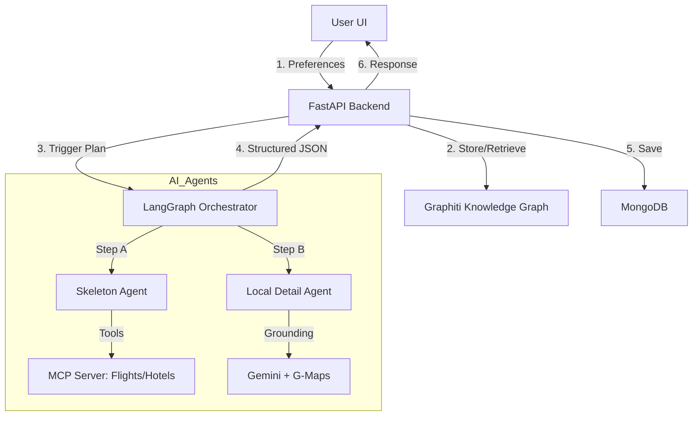

# System Architecture: AI Travel Planner

## 1. High Level Overview
The application is a Generative AI travel planner that creates detailed, day-by-day itineraries based on user preferences (stored in a Knowledge Graph) and real-time data (via MCP tools).

## 2. Tech Stack
*   **Frontend:** React / Next.js /idk but we'll figure it out
*   **Backend:** Python FastAPI
*   **Database:** 
    *   *Itinerary Storage:* MongoDB (NoSQL for JSON documents).
    *   *User Memory:* Graphiti (Knowledge Graph for preferences).
    *   *User data* some sort of SQL server
*   **AI Orchestration:** LangGraph (Agent workflow) (considering checking out CrewAI too)
*   **AI Models:** 
    *   Core Logic: Anything
    *   Local/Maps Grounding: Gemini Pro (via Google Maps API).

## 3. Data Flow Diagram

---

