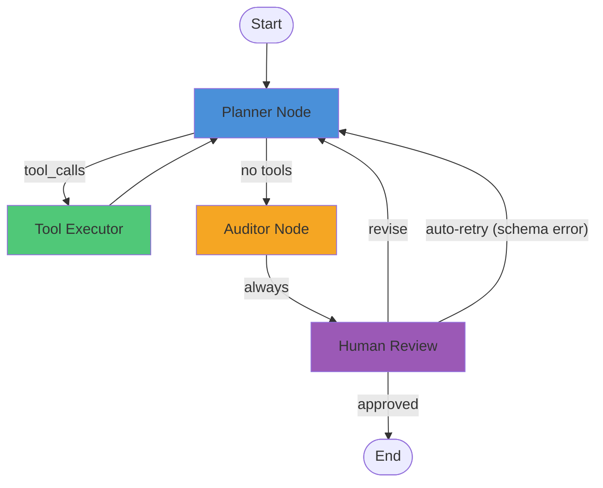
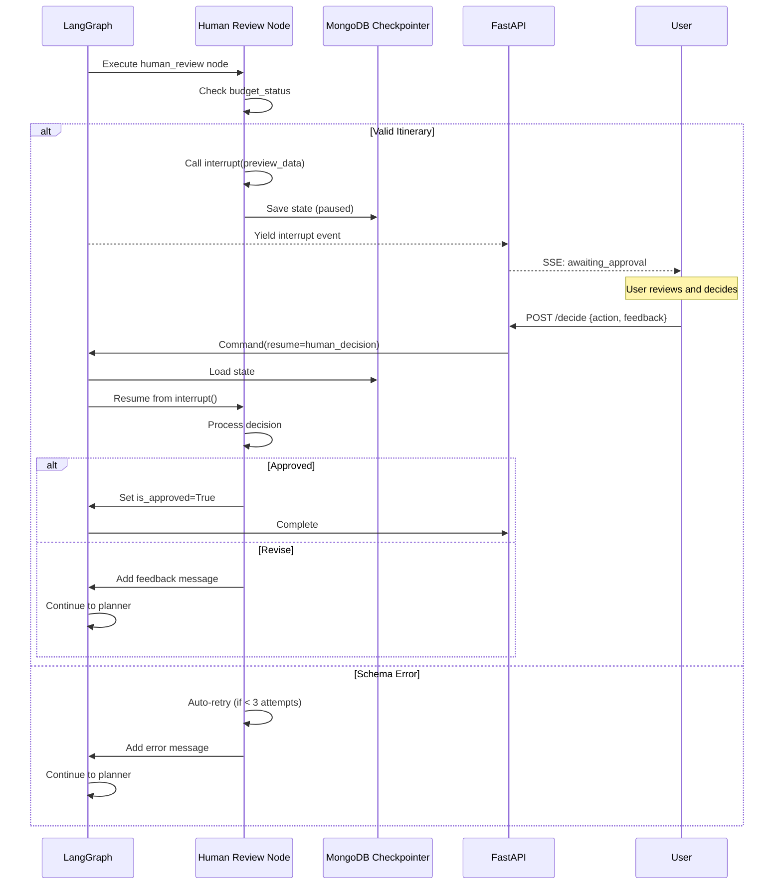

# LangGraph Agent Architecture

> **Note:** This documentation describes `agent_graph_v3.py` - the current production version with web-compatible HITL. `agent_graph_v2.py` is deprecated.

## Overview

The trip planning agent uses LangGraph to orchestrate a multi-step workflow with tool calling, validation, and human-in-the-loop review.

## Graph Structure



## State Schema

```python
class PlanState(TypedDict):
    messages: list[BaseMessage]      # Conversation history
    preferences: dict                 # User preferences (destinations, dates, budget)
    current_itinerary: dict | None   # Latest parsed itinerary
    total_cost: float | None         # Calculated total cost
    cost_breakdown: dict | None      # Cost by category
    budget_status: str               # "unknown" | "under" | "over"
    is_approved: bool                # Set by human review node
    revision_count: int              # Number of revisions
    current_step: str | None         # Current step name for progress tracking
```

## Node Descriptions

### 1. Planner Node

**Purpose:** Generate or revise the trip itinerary using LLM with tools.

**Input:** Current state with preferences and any feedback messages.

**Output:** Either tool calls (→ Tool Executor) or final JSON itinerary (→ Auditor).

**Behavior:**
- First run: Searches for flights/hotels, generates complete itinerary
- Revision: Incorporates feedback, may re-search for alternatives
- Uses system prompt from `app/prompts.py`

### 2. Tool Executor

**Purpose:** Execute MCP tools (flight search, hotel search, airport codes).

**Input:** Tool call requests from Planner.

**Output:** Tool results appended to messages.

**Tools Available:**
- `get_airport_code(city_name)` - Look up IATA codes
- `search_flights(origin, destination, date, return_date?)` - Find flights
- `search_hotels(city_code, check_in, check_out)` - Find hotels

### 3. Auditor Node

**Purpose:** Parse and validate the LLM's JSON output, calculate costs.

**Input:** LLM response containing JSON itinerary.

**Output:** Parsed itinerary with cost breakdown, or error feedback.

**Validation Steps:**
1. Extract JSON from response
2. Validate against schema (Pydantic)
3. Sum costs by category (flights, hotels, activities)
4. Check against budget limit

**On Failure:** Sets `budget_status="unknown"` and sends error message. Always routes to Human Review, which handles retry logic.

### 4. Human Review Node

**Purpose:** Handle schema errors (auto-retry) or interrupt for human decision.

**Input:** State from Auditor (may have errors or valid itinerary).

**Output:** Either approval (→ End) or revision request (→ Planner).

**Behavior:**
- **Schema validation failed** (`budget_status="unknown"`): Auto-retry up to 3 times, then fail
- **Valid itinerary** (under or over budget): Calls `interrupt(preview_data)` to pause and wait for human decision

**Web Flow:**
1. Node calls `interrupt(preview_data)` for valid itineraries
2. Graph execution pauses, state saved to MongoDB
3. SSE sends `awaiting_approval` event to frontend
4. User submits decision via API
5. Graph resumes with `Command(resume=human_decision)`
6. Node processes decision and routes accordingly

## Edge Routing

```python
def route_after_planner(state: PlanState) -> Literal["tools", "auditor"]:
    """Route from planner to tools or auditor"""
    last_message = state["messages"][-1]
    if hasattr(last_message, 'tool_calls') and last_message.tool_calls:
        return "tools"      # Execute tool calls
    return "auditor"        # Parse/validate response

# Auditor always routes to human_review (hard edge, no conditional)

def route_after_review(state: PlanState) -> Literal["planner", "__end__"]:
    """Route from human review based on approval status"""
    is_approved = state.get("is_approved", False)
    current_step = state.get("current_step", "")
    
    if is_approved:
        return "__end__"
    
    # Failed max retries - end
    if current_step == "failed_max_retries":
        return "__end__"
    
    # Revision requested or retrying - back to planner
    return "planner"
```

## Interrupt/Resume Pattern



## Configuration

```python
# Build graph (no interrupt_before - interrupt happens inside node)
graph = builder.compile(
    checkpointer=MongoDBCheckpointer(db)
)

# Run configuration
config = {
    "configurable": {
        "thread_id": session_id  # Unique per session
    },
    "recursion_limit": 50
}

# Resume from interrupt
from langgraph.types import Command
input_data = Command(resume=human_decision)
```

