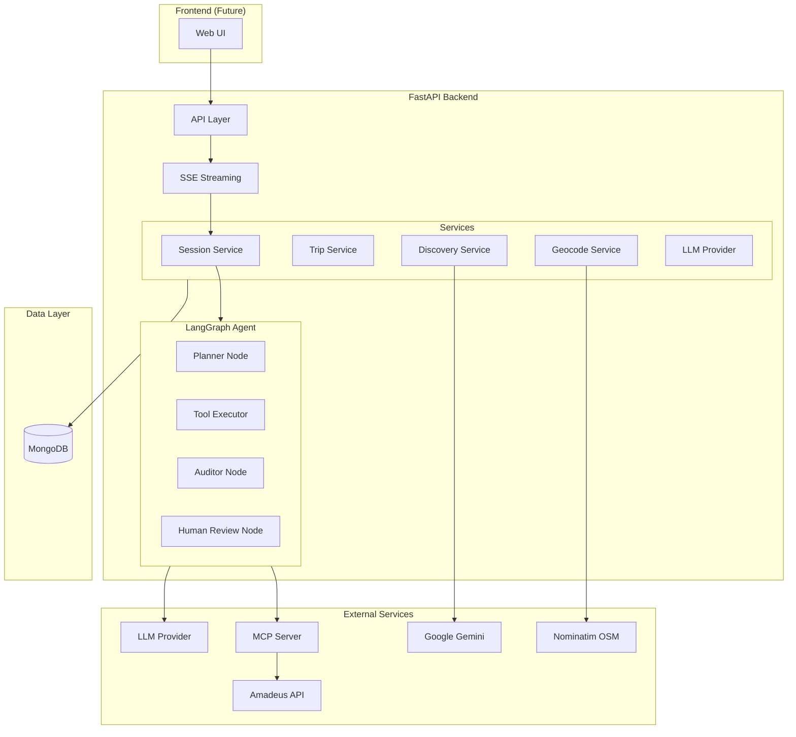
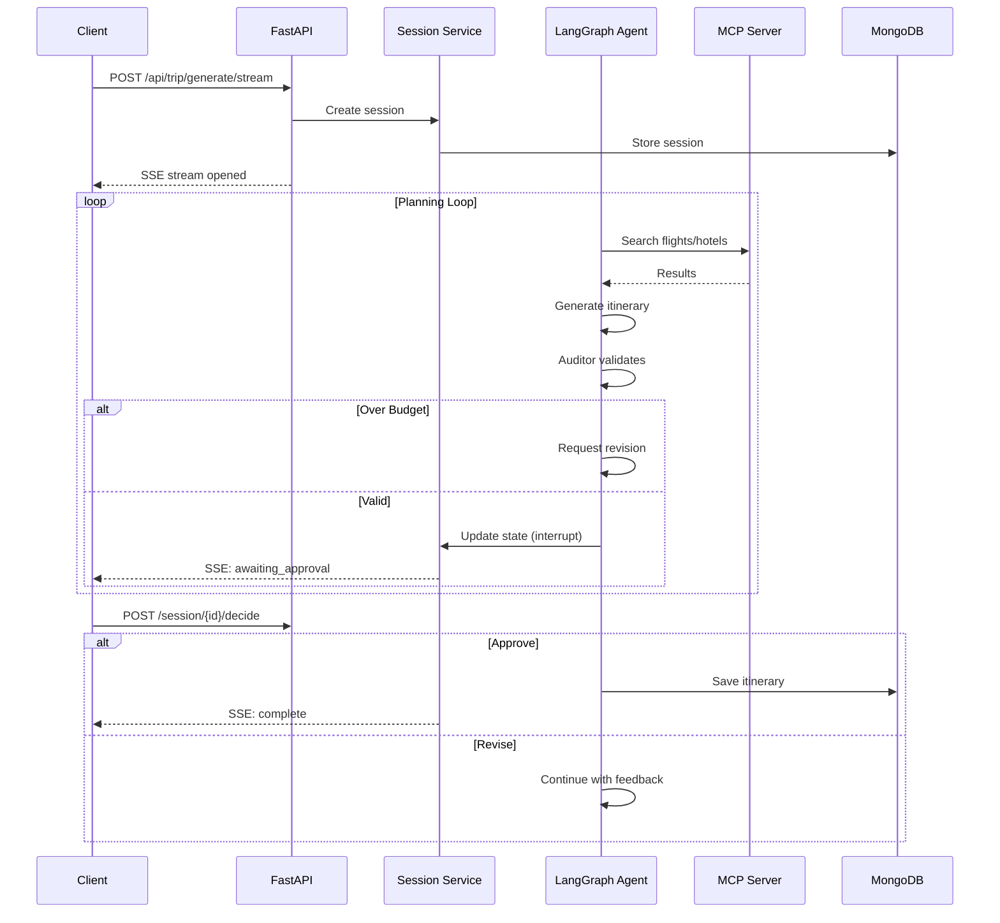
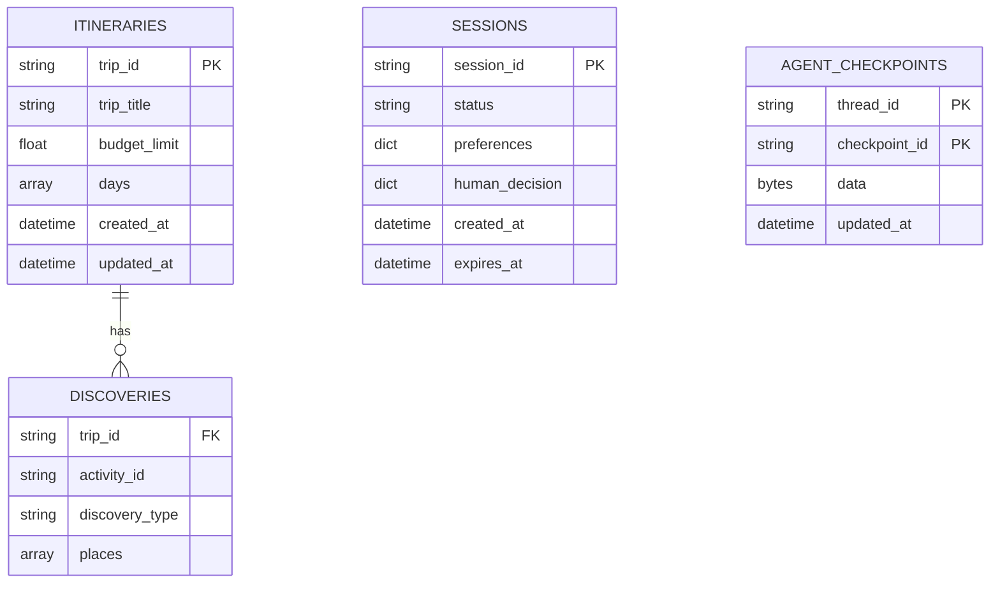

# System Architecture

## Overview

Coastline is an AI-powered travel planning application with a Human-in-the-Loop (HITL) workflow. The system generates multi-city itineraries using LLM agents, validates costs against user budgets, and allows iterative refinement based on user feedback.

## High-Level Architecture

## Component Overview

| Component | Purpose | Key Files |
|-----------|---------|-----------|
| **API Layer** | HTTP endpoints, request validation | `app/routers/` |
| **Session Service** | HITL session management, state persistence | `app/services/session.py` |
| **LangGraph Agent** | Trip planning, tool orchestration | `agent_graph_v3.py` |
| **MCP Server** | Amadeus API integration, cost calculation | `mcp/server.py` |
| **Discovery Service** | Nearby places (restaurants, bars, etc.) | `app/services/discovery.py` |
| **Geocode Service** | Address → coordinates conversion | `app/services/geocode.py` |

## Data Flow

### Trip Generation Flow

## Database Schema

## Key Design Decisions

1. **SSE over WebSockets** - Simpler implementation, sufficient for one-way streaming
2. **MongoDB Checkpointer** - Persists agent state for interrupt/resume capability
3. **MCP Protocol** - Standardized tool interface, separation of concerns
4. **LLM Provider Abstraction** - Easy switching between OpenAI/Anthropic/Google
5. **Geocoding Post-Processing** - LLM generates addresses, backend geocodes for coordinates

