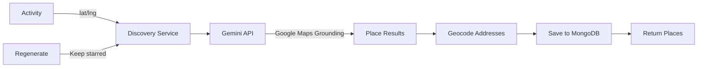
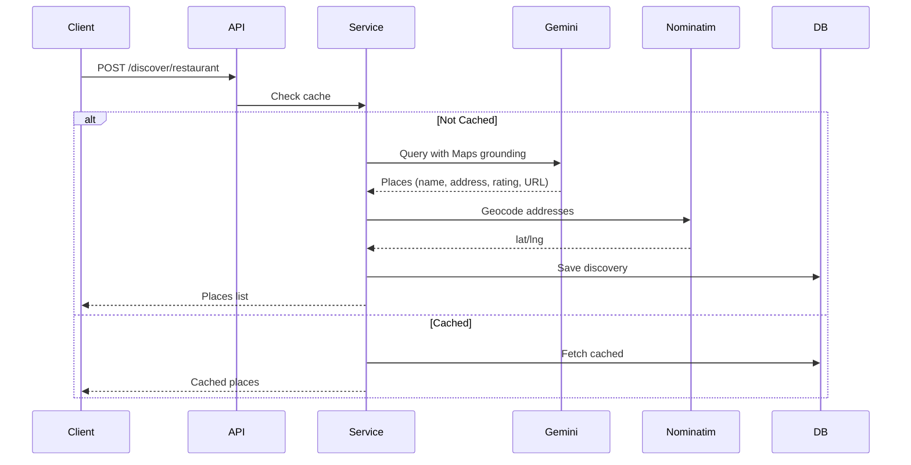
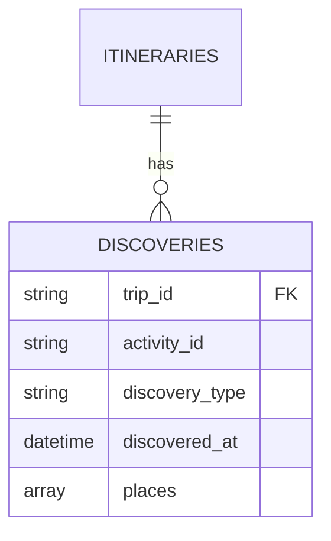

# Discovery Service

## Overview

The discovery service finds nearby places (restaurants, bars, cafes, clubs) around trip activities using Google Gemini with Maps grounding. Results are cached per activity and can be regenerated while preserving starred favorites.

## Architecture



## Supported Place Types

- `restaurant` - Restaurants and dining
- `bar` - Bars and pubs
- `cafe` - Cafes and coffee shops
- `club` - Nightclubs and dance venues

## Flow

### 1. Initial Discovery



### 2. Regeneration

When `regenerate=true`:
1. Fetch existing discovery
2. Keep all starred places
3. Fetch new places from Gemini
4. Merge: starred + new
5. Save updated discovery

## Data Model

```python
class DiscoveredPlace:
    id: str                    # UUID
    place_type: DiscoveryType   # restaurant | bar | cafe | club
    name: str
    address: str
    rating: float | None       # 0-5, or None if unavailable
    price_range: str | None    # "$", "$$", etc.
    google_maps_url: str
    lat: float                 # Geocoded coordinates
    lng: float
    starred: bool              # User favorite flag
    extra_data: dict           # Type-specific fields
```

## API Endpoints

### Discover Places

```http
POST /api/trip/{trip_id}/activities/{activity_id}/discover/{place_type}?regenerate=false
```

**Behavior:**
- First call: Discovers and caches places
- Subsequent calls: Returns cached places
- `regenerate=true`: Fetches new places, keeps starred

**Requirements:**
- Activity must exist
- Activity must have `lat`/`lng` coordinates

**Response:** `list[DiscoveredPlace]`

### Star/Unstar Place

```http
PUT /api/trip/{trip_id}/activities/{activity_id}/discover/{place_type}/{place_id}/star
```

**Body:**
```json
{
  "starred": true
}
```

### Get All Discoveries

```http
GET /api/trip/{trip_id}/discoveries?place_type=restaurant
```

Returns all discoveries for a trip, optionally filtered by type.

### Delete Discovery

```http
DELETE /api/trip/{trip_id}/activities/{activity_id}/discover/{place_type}
```

Clears all places for an activity/type combination.

## Implementation Details

### Gemini Integration

- Uses Google Gemini 2.5 Flash with Google Maps grounding
- Prompts include location context (lat/lng)
- Output validated against `PlaceLLMCreate` schema
- Retry logic: 1 retry on validation failure

### Geocoding

- Addresses geocoded via Nominatim OpenStreetMap
- Fallback: Use activity coordinates if geocoding fails
- Ensures all places have `lat`/`lng` for mapping

### Caching Strategy

- Discoveries stored per `(trip_id, activity_id, place_type)` tuple
- Compound unique index for efficient lookups
- Regeneration preserves starred places across refreshes

## Error Handling

| Error | Handling |
|-------|----------|
| Activity missing coordinates | 400 Bad Request |
| Activity not found | 404 Not Found |
| Gemini validation failure | Retry once, then return empty list |
| Geocoding failure | Use activity coordinates as fallback |

## Database Schema



**Index:** `(trip_id, activity_id, discovery_type)` - unique compound index

