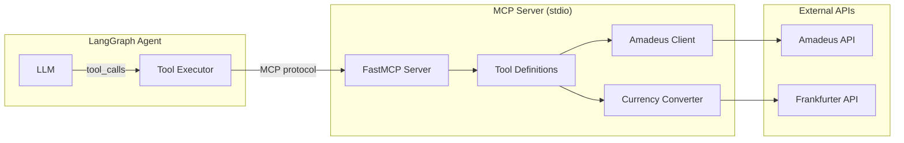
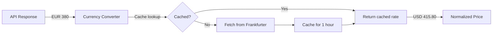

# MCP Server Design

## Overview

The MCP (Model Context Protocol) server provides a standardized interface for the LangGraph agent to interact with external APIs, primarily the Amadeus travel API.

## Architecture



## Tool Definitions

### `get_airport_code`

Converts city name to IATA airport code.

```python
@mcp.tool()
@retry_amadeus_api()  # Max 2 retries with exponential backoff
def get_airport_code(city_name: str) -> dict:
    """
    Get IATA airport code for a city.
    
    Args:
        city_name: City name (e.g., "New York", "London")
    
    Returns:
        {"code": "JFK", "name": "John F Kennedy Intl"}
    """
```

### `search_flights`

Search for flight options between two cities.

```python
@mcp.tool()
@retry_amadeus_api()
def search_flights(
    origin: str,           # Origin IATA code (e.g., "JFK")
    destination: str,      # Destination IATA code (e.g., "LHR")  
    departure_date: str,   # YYYY-MM-DD format
    return_date: str = None  # Optional for round-trip
) -> dict:
    """
    Returns:
        {
            "flights": [
                {
                    "price": 450.00,
                    "currency": "USD",
                    "departure": "2024-03-15T08:00:00",
                    "arrival": "2024-03-15T20:00:00",
                    "airline": "British Airways",
                    "stops": 0
                },
                ...
            ],
            "count": 5
        }
    """
```

### `search_hotels`

Search for hotel options in a city.

```python
@mcp.tool()
@retry_amadeus_api()
def search_hotels(
    city_code: str,      # IATA code (e.g., "LON")
    check_in_date: str,  # YYYY-MM-DD
    check_out_date: str  # YYYY-MM-DD
) -> dict:
    """
    Returns:
        {
            "hotels": [
                {
                    "name": "Hilton London",
                    "price": 850.00,  # TOTAL for stay
                    "currency": "USD",
                    "rating": 4,
                    "address": "123 Main St, London"
                },
                ...
            ],
            "count": 5,
            "nights": 3
        }
    """
```

## Retry Logic

All Amadeus API calls use exponential backoff for rate limit handling:

```python
def retry_amadeus_api(max_retries: int = 2, base_delay: int = 1):
    """
    Decorator for Amadeus API calls with exponential backoff.
    
    - Max 2 retries (3 total attempts)
    - Delays: 1s, 2s between retries
    - Handles: 429 (rate limit), 503 (service unavailable)
    """
```

## Currency Conversion

All prices are normalized to USD using the Frankfurter API:



**Fallback rates:** If Frankfurter is unavailable, static fallback rates are used.

## MCP Protocol

The server uses the stdio transport for communication:

```python
# Server initialization
mcp = FastMCP("coastline-travel")

# Client connection (in agent)
async with MultiServerMCPClient({
    "coastline": {
        "command": "python",
        "args": ["-m", "mcp.server"],
        "transport": "stdio"
    }
}) as client:
    tools = client.get_tools()
```

## File Structure

```
mcp/
├── server.py      # Tool definitions, Amadeus client
└── currency.py    # Currency conversion utilities
```

## Environment Variables

```bash
AMADEUS_API_KEY=your_api_key
AMADEUS_API_SECRET=your_api_secret
```

## Error Handling

| Error | Handling |
|-------|----------|
| Rate limit (429) | Exponential backoff, max 3 attempts |
| Invalid city | Return error message to LLM |
| No results | Return empty list with message |
| API timeout | Retry with backoff |
| Auth failure | Return error, check credentials |

