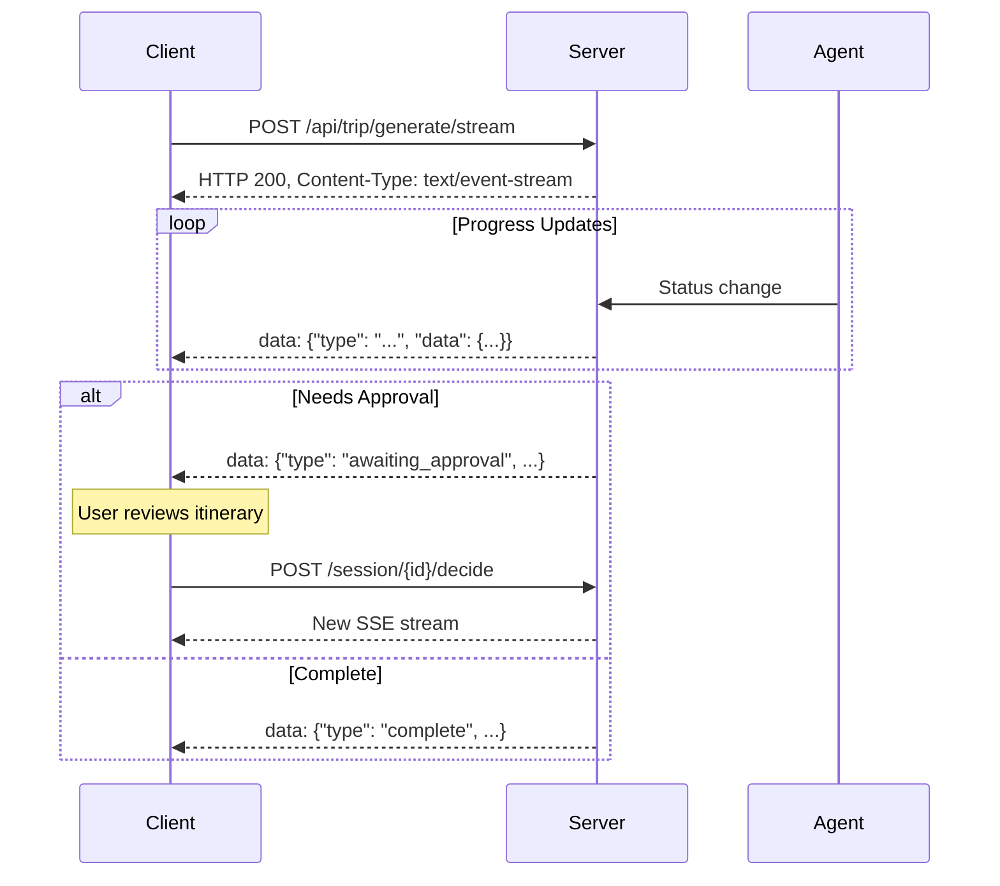
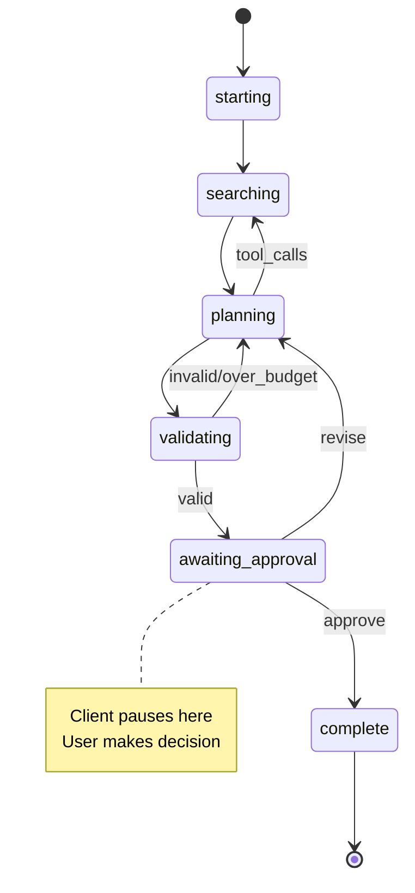

# Server-Sent Events (SSE)

## Overview

The trip generation endpoint uses SSE to stream real-time progress updates to the client. This enables a responsive UI during long-running AI operations.

## Connection Flow



## Event Types

### `starting`

Agent initialization.

```json
{
  "type": "starting",
  "data": {
    "message": "Starting trip generation..."
  }
}
```

### `searching`

Tool execution (flights/hotels).

```json
{
  "type": "searching",
  "data": {
    "message": "Searching for flights and hotels..."
  }
}
```

### `planning`

LLM generating itinerary.

```json
{
  "type": "planning",
  "data": {
    "message": "AI is planning your trip..."
  }
}
```

### `validating`

Auditor checking costs.

```json
{
  "type": "validating",
  "data": {
    "message": "Validating itinerary and costs..."
  }
}
```

### `awaiting_approval`

Itinerary ready for review. **Client should pause and display UI.**

```json
{
  "type": "awaiting_approval",
  "data": {
    "session_id": "abc123",
    "status": "awaiting_approval",
    "preview": {
      "trip_title": "8 Days in London and Paris",
      "total_cost": 2750.00,
      "budget": 3000.00,
      "budget_status": "under",
      "over_budget": false,
      "revision_count": 0,
      "days": [
        {
          "day_number": 1,
          "theme": "Departure from Seattle",
          "city": "Seattle",
          "activities": [...]
        }
      ]
    }
  }
}
```

### `complete`

Trip saved successfully.

```json
{
  "type": "complete",
  "data": {
    "status": "complete",
    "trip_id": "trip_xyz789",
    "message": "Trip saved successfully!"
  }
}
```

### `error`

Something went wrong.

```json
{
  "type": "error",
  "data": {
    "message": "Failed to generate itinerary: API rate limit exceeded"
  }
}
```

## Client Implementation

### JavaScript/TypeScript

```typescript
const startGeneration = async (preferences: Preferences) => {
  const response = await fetch('/api/trip/generate/stream', {
    method: 'POST',
    headers: { 'Content-Type': 'application/json' },
    body: JSON.stringify(preferences)
  });

  const reader = response.body?.getReader();
  const decoder = new TextDecoder();
  let sessionId = '';

  while (true) {
    const { done, value } = await reader.read();
    if (done) break;

    const chunk = decoder.decode(value);
    const lines = chunk.split('\n');

    for (const line of lines) {
      if (line.startsWith('data: ')) {
        const event = JSON.parse(line.slice(6));
        handleEvent(event);
        
        if (event.type === 'awaiting_approval') {
          sessionId = event.data.session_id;
        }
      }
    }
  }
};

const handleEvent = (event: SSEEvent) => {
  switch (event.type) {
    case 'starting':
    case 'searching':
    case 'planning':
    case 'validating':
      setStatus(event.data.message);
      break;
      
    case 'awaiting_approval':
      setItinerary(event.data.preview);
      showApprovalDialog();
      break;
      
    case 'complete':
      navigateToTrip(event.data.trip_id);
      break;
      
    case 'error':
      showError(event.data.message);
      break;
  }
};
```

### Submitting Decision

```typescript
const submitDecision = async (
  sessionId: string, 
  action: 'approve' | 'revise',
  feedback?: string,
  newBudget?: number
) => {
  const response = await fetch(`/api/trip/session/${sessionId}/decide`, {
    method: 'POST',
    headers: { 'Content-Type': 'application/json' },
    body: JSON.stringify({ action, feedback, new_budget: newBudget })
  });

  // Handle new SSE stream for revision or completion
  // ... same pattern as startGeneration
};
```

## State Machine



## Error Handling

### Connection Dropped

If SSE connection drops:
1. Check session status: `GET /api/trip/session/{id}/status`
2. If `awaiting_approval`, show approval UI
3. If `processing`, reconnect and wait
4. If `complete`, redirect to trip

### Timeout

Long operations (>60s) may timeout. Client should:
1. Store `session_id` from first `awaiting_approval` event
2. On timeout, poll session status
3. Resume from last known state

