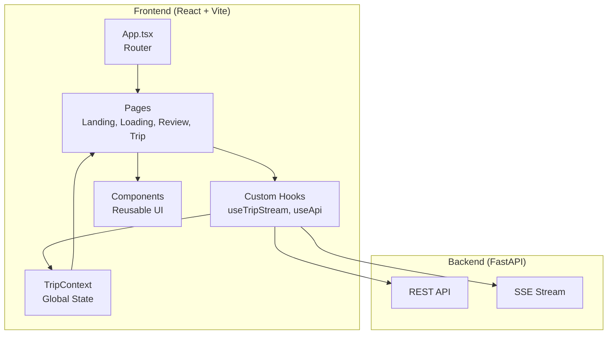
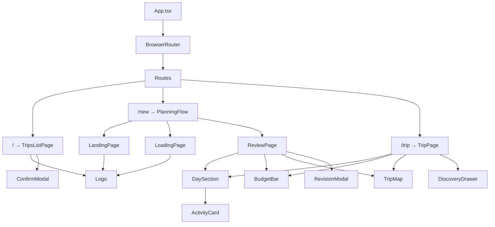
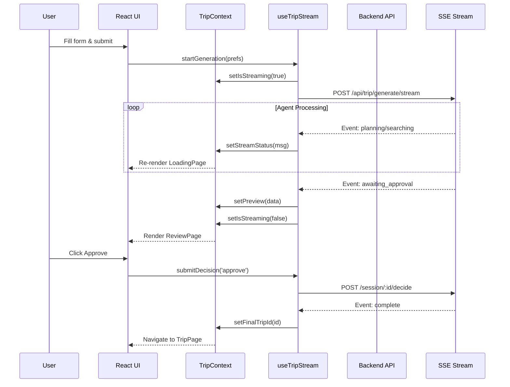
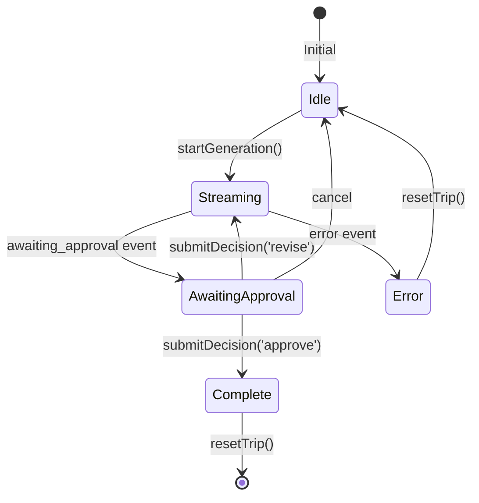
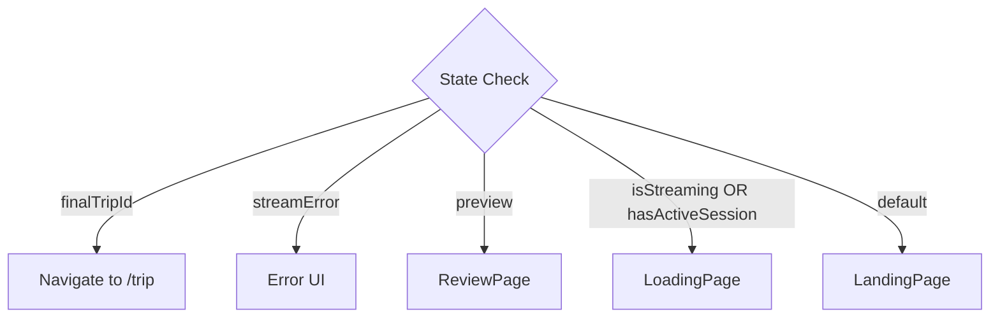

# Frontend Architecture

System design, component hierarchy, and data flow.

## High-Level Overview



## Technology Stack

| Layer | Technology | Purpose |
|-------|------------|---------|
| Framework | React 19 | UI components |
| Build | Vite 7 | Dev server, bundling |
| Language | TypeScript 5.9 | Type safety |
| Routing | React Router v7 | Client-side navigation |
| State | React Context | Global state management |
| Styling | CSS Modules | Scoped component styles |
| Icons | Lucide React | SVG icon library |
| Maps | Leaflet + react-leaflet | Interactive maps |
| SSE | @microsoft/fetch-event-source | Robust SSE client |
| Dates | date-fns | Date formatting |

## Component Hierarchy



## Data Flow



## State Architecture

### Global State (TripContext)

```typescript
interface TripContextType {
  // User Input
  preferences: TripPreferences | null;
  
  // Session Management
  sessionId: string | null;
  
  // SSE State
  isStreaming: boolean;
  streamStatus: string;
  streamError: string | null;
  
  // HITL State
  preview: TripPreview | null;
  
  // Completion
  finalTripId: string | null;
  
  // Persistence
  startedAt: number | null;
  activeSession: ActiveSession | null;
  hasActiveSession: boolean;
  
  // Actions
  resetTrip: () => void;
  restoreSession: () => ActiveSession | null;
}
```

### State Transitions



## Routing Architecture

| Route | Component | Purpose |
|-------|-----------|---------|
| `/` | TripsListPage | List saved trips, in-progress banner |
| `/new` | PlanningFlow | Dynamic: Landing → Loading → Review |
| `/trip?id=...` | TripPage | View saved trip with discovery |

### PlanningFlow Logic



## Styling Architecture

### CSS Modules Pattern

Each component has a paired `.module.css` file:

```
components/
├── ActivityCard.tsx
├── ActivityCard.module.css
├── BudgetBar.tsx
├── BudgetBar.module.css
```

### Global Variables (index.css)

```css
:root {
  --primary: #0f172a;
  --primary-light: #e0f2fe;
  --text: #0f172a;
  --text-muted: #64748b;
  --bg: #f8fafc;
  --surface: #ffffff;
  --border: #e2e8f0;
}
```

### Design Principles

1. **Split-screen layout** for review/trip pages (itinerary | map)
2. **Cards** for trip listings and activities
3. **Soft shadows and rounded corners** for modern feel
4. **Blue accent color** for primary actions
5. **Responsive padding and spacing**

## API Communication

### REST API (useApi hook)

```typescript
// Trip operations
useTrips(): { getTrip, listTrips, deleteTrip }

// Discovery operations  
useDiscovery(): { discoverPlaces, starPlace, getAllDiscoveries }
```

### SSE Streaming (useTripStream hook)

```typescript
useTripStream(): {
  startGeneration,  // POST /api/trip/generate/stream
  submitDecision,   // POST /api/trip/session/:id/decide
  reconnectSession, // GET /api/trip/session/:id/status
  cancelStream      // Abort controller
}
```

## Key Patterns

### 1. Context + Hooks Separation

- **Context**: Holds state, provides setters
- **Hooks**: Contain logic, call APIs, update context

### 2. Optimistic Updates

- Navigate immediately after approve
- Geocoding happens in background
- Poll for status updates

### 3. Session Persistence

- Save to localStorage on state changes
- Restore on page reload
- 30-minute expiration

### 4. Discovery Caching

- Cache by activity ID + type
- Persist across drawer open/close
- Refresh on demand

## Error Handling

| Error Type | Handling |
|------------|----------|
| SSE Connection Failed | Show error UI, allow retry |
| API 422 (Validation) | Parse details, display message |
| API 404 (Not Found) | Clear session, show not found |
| Network Error | Show generic error, allow retry |

## Performance Considerations

1. **Memoization**: `useMemo` for computed values
2. **Callbacks**: `useCallback` for stable references
3. **Refs**: Track active connections, prevent duplicates
4. **Lazy loading**: Pages loaded on route access
5. **Debounced polling**: 2-second intervals for geocoding

