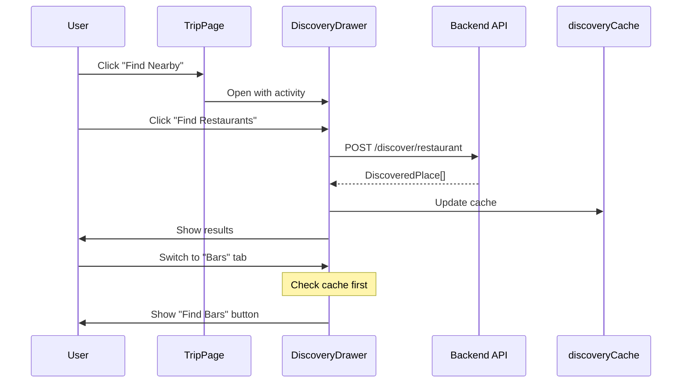
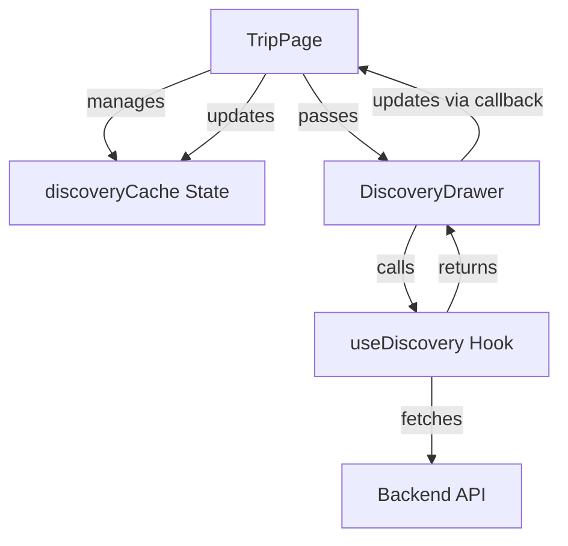
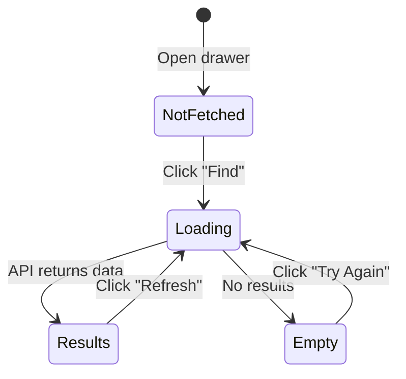

# Discovery

Place discovery feature, drawer component, and caching strategy.

## Overview

The Discovery feature allows users to find nearby restaurants, bars, cafes, and clubs for each activity in their trip.



## Discovery Types

```typescript
type DiscoveryType = 'restaurant' | 'bar' | 'cafe' | 'club';
```

| Type | Emoji | Label |
|------|-------|-------|
| restaurant | 🍽️ | Restaurants |
| bar | 🍸 | Bars |
| cafe | ☕ | Cafes |
| club | 🎵 | Clubs |

## Data Model

### DiscoveredPlace

```typescript
interface DiscoveredPlace {
  id: string;
  place_type: DiscoveryType;
  name: string;
  address: string;
  rating?: number | null;
  price_range?: string | null;
  google_maps_url: string;
  lat: number;
  lng: number;
  starred: boolean;
  extra_data?: Record<string, unknown>;
}
```

## Architecture



## Caching Strategy

### Cache Structure

```typescript
// TripPage.tsx
type DiscoveryCache = Record<string, Partial<Record<DiscoveryType, DiscoveredPlace[]>>>;
// { activityId: { restaurant: [...], bar: [...], ... } }

const [discoveryCache, setDiscoveryCache] = useState<DiscoveryCache>({});
```

### Cache Lifecycle

1. **Load on mount** — Fetch all existing discoveries for the trip
2. **Lazy fetch** — Only fetch a type when user clicks "Find"
3. **Persist across drawer** — Cache survives drawer close/reopen
4. **Refresh on demand** — User can regenerate with "Refresh" button

### Load Existing Discoveries

```typescript
// TripPage.tsx
const loadDiscoveries = useCallback(async () => {
  if (!tripId) return;
  const discoveries = await getAllDiscoveries(tripId);
  
  const cache: DiscoveryCache = {};
  for (const disc of discoveries) {
    const activityId = disc.activity_id;
    const discType = disc.discovery_type as DiscoveryType;
    if (!cache[activityId]) cache[activityId] = {};
    cache[activityId][discType] = disc.places || [];
  }
  setDiscoveryCache(cache);
}, [tripId, getAllDiscoveries]);
```

## useDiscovery Hook

```typescript
// useApi.ts
export const useDiscovery = () => {
  const [loading, setLoading] = useState(false);
  const [error, setError] = useState<string | null>(null);

  const discoverPlaces = useCallback(async (
    tripId: string,
    activityId: string,
    placeType: DiscoveryType,
    regenerate = false
  ): Promise<DiscoveredPlace[]> => {
    setLoading(true);
    try {
      const url = `/api/trip/${tripId}/activities/${activityId}/discover/${placeType}?regenerate=${regenerate}`;
      const res = await fetch(url, { method: 'POST' });
      if (!res.ok) throw new Error('Discovery failed');
      return await res.json();
    } finally {
      setLoading(false);
    }
  }, []);

  const starPlace = useCallback(async (
    tripId: string,
    activityId: string,
    placeType: DiscoveryType,
    placeId: string,
    starred: boolean
  ): Promise<DiscoveredPlace | null> => {
    const url = `/api/trip/${tripId}/activities/${activityId}/discover/${placeType}/${placeId}/star`;
    const res = await fetch(url, { 
      method: 'PUT',
      headers: { 'Content-Type': 'application/json' },
      body: JSON.stringify({ starred })
    });
    if (!res.ok) return null;
    return await res.json();
  }, []);

  const getAllDiscoveries = useCallback(async (tripId: string) => {
    const res = await fetch(`/api/trip/${tripId}/discoveries`);
    if (!res.ok) return [];
    return await res.json();
  }, []);

  return { discoverPlaces, starPlace, getAllDiscoveries, loading, error };
};
```

## DiscoveryDrawer Component

### Props

```typescript
interface DiscoveryDrawerProps {
  activity: Activity;
  tripId: string;
  onClose: () => void;
  onDiscover: (activityId: string, type: DiscoveryType, regenerate: boolean) => Promise<DiscoveredPlace[]>;
  onStar: (activityId: string, type: DiscoveryType, placeId: string, starred: boolean) => Promise<void>;
  discoveries: Partial<Record<DiscoveryType, DiscoveredPlace[]>>;
}
```

### State

```typescript
const [activeType, setActiveType] = useState<DiscoveryType>('restaurant');
const [loadingType, setLoadingType] = useState<DiscoveryType | null>(null);
```

### UI States



| State | Condition | UI |
|-------|-----------|-----|
| Loading | `loadingType === activeType` | Spinner + "Finding..." |
| Not Fetched | `!(activeType in discoveries)` | "Find [Type]" button |
| Empty | `discoveries[type].length === 0` | "No results" + retry |
| Results | `discoveries[type].length > 0` | Place cards |

### Tab Switching

```typescript
const handleTabChange = (type: DiscoveryType) => {
  setActiveType(type);
  // No API call - shows cached data or "Find" button
};
```

### Find Places

```typescript
const handleFind = async (regenerate = false) => {
  setLoadingType(activeType);
  try {
    await onDiscover(activity.id, activeType, regenerate);
  } finally {
    setLoadingType(null);
  }
};
```

### Star Place

```typescript
const handleStar = async (placeId: string, starred: boolean) => {
  await onStar(activity.id, activeType, placeId, starred);
};
```

## TripPage Integration

### Opening the Drawer

```typescript
const handleDiscoveryClick = (activity: Activity) => {
  // Require coordinates
  if (!activity.location.lat || !activity.location.lng) {
    if (isGeocoding) {
      alert('📍 This location is still being geocoded...');
    } else {
      alert('No coordinates for discovery.');
    }
    return;
  }
  
  setSelectedActivity(activity);
  setDiscoveryOpen(true);
};
```

### Discovery Callback

```typescript
const handleDiscover = useCallback(async (
  activityId: string, 
  type: DiscoveryType, 
  regenerate: boolean
): Promise<DiscoveredPlace[]> => {
  if (!tripId) return [];
  
  const results = await discoverPlaces(tripId, activityId, type, regenerate);
  
  // Update cache
  setDiscoveryCache(prev => ({
    ...prev,
    [activityId]: {
      ...prev[activityId],
      [type]: results
    }
  }));
  
  return results;
}, [tripId, discoverPlaces]);
```

### Star Callback

```typescript
const handleStar = useCallback(async (
  activityId: string,
  type: DiscoveryType,
  placeId: string,
  starred: boolean
): Promise<void> => {
  if (!tripId) return;
  
  await starPlace(tripId, activityId, type, placeId, starred);
  
  // Update cache
  setDiscoveryCache(prev => ({
    ...prev,
    [activityId]: {
      ...prev[activityId],
      [type]: (prev[activityId]?.[type] || []).map(p =>
        p.id === placeId ? { ...p, starred } : p
      )
    }
  }));
}, [tripId, starPlace]);
```

## API Endpoints

| Method | Endpoint | Purpose |
|--------|----------|---------|
| POST | `/api/trip/:tripId/activities/:activityId/discover/:type` | Find places |
| PUT | `/api/trip/:tripId/activities/:activityId/discover/:type/:placeId/star` | Star/unstar |
| GET | `/api/trip/:tripId/discoveries` | Get all discoveries |

### Query Parameters

- `regenerate=true` — Force new search (bypass cache)

### Request Body (Star)

```json
{
  "starred": true
}
```

## PlaceCard Sub-component

```typescript
const PlaceCard = ({ place, onStar }: { 
  place: DiscoveredPlace; 
  onStar: (starred: boolean) => void;
}) => (
  <div className={styles.placeCard}>
    <div className={styles.placeTop}>
      <span>{place.name}</span>
      <button onClick={() => onStar(!place.starred)}>
        <Star fill={place.starred ? 'currentColor' : 'none'} />
      </button>
    </div>
    <div className={styles.placeMeta}>
      {place.rating && <span>⭐ {place.rating.toFixed(1)}</span>}
      {place.price_range && <span>{place.price_range}</span>}
    </div>
    <div>{place.address}</div>
    <a href={place.google_maps_url} target="_blank">Open in Maps</a>
  </div>
);
```

## Geocoding Dependency

Discovery requires activity coordinates. During geocoding:

1. Check `isGeocoding` flag from trip's `geocoding_status`
2. If coordinates missing and geocoding in progress, show message
3. If coordinates missing and geocoding complete, show error

```typescript
if (!activity.location.lat || !activity.location.lng) {
  if (isGeocoding) {
    alert('📍 This location is still being geocoded. Please wait...');
  } else {
    alert('No coordinates available for this location.');
  }
  return;
}
```

## Related

- [Backend Discovery Docs](../../backend/docs/DISCOVERY.md)
- [COMPONENTS.md](./COMPONENTS.md) - DiscoveryDrawer component
- [PAGES.md](./PAGES.md) - TripPage integration

