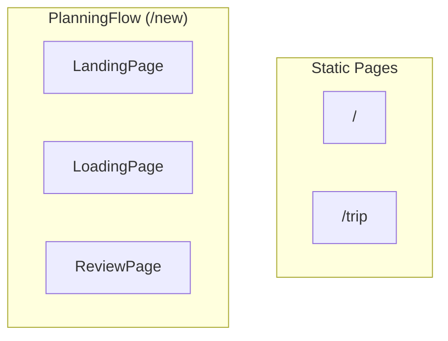

# Pages

Page components, user flows, and state dependencies.

## Overview

Coastline has 5 page components, with `PlanningFlow` dynamically switching between 3 of them.



## Page Directory

```
src/pages/
├── LandingPage.tsx      + .module.css
├── LoadingPage.tsx      + .module.css
├── ReviewPage.tsx       + .module.css
├── TripPage.tsx         + .module.css
└── TripsListPage.tsx    + .module.css
```

---

## TripsListPage

**Route:** `/`

**Purpose:** Home screen showing all saved trips and in-progress generation.

### Features

- List of saved trip cards (sorted by most recent)
- "In Progress" banner when generation is ongoing
- "New Trip" button
- Delete trips directly from list
- Empty state with CTA

### State Dependencies

```typescript
const { activeSession, hasActiveSession, resetTrip } = useTrip();
const { listTrips, deleteTrip, loading } = useTrips();
```

### Key Components Used

- `Logo`
- `ConfirmModal` (for delete confirmation)

### User Interactions

| Action | Handler |
|--------|---------|
| Click trip card | `navigate('/trip?id=...')` |
| Click "New Trip" | `navigate('/new')` |
| Click in-progress banner | `navigate('/new')` |
| Click delete icon | Show ConfirmModal |
| Confirm delete | `deleteTrip(tripId)` |

### API Calls

- `GET /api/trips` — Load trips on mount
- `DELETE /api/trip/:id` — Delete trip

---

## LandingPage

**Route:** `/new` (when idle)

**Purpose:** Trip preferences form.

### Features

- Multi-destination input (chips pattern)
- Date pickers for start/end
- Budget input
- Origin city input
- Form validation

### State Dependencies

```typescript
const { setPreferences } = useTrip();
const { startGeneration } = useTripStream();
```

### Local State

```typescript
const [destinations, setDestinations] = useState<string[]>(['London', 'Paris']);
const [currentDest, setCurrentDest] = useState('');
const [startDate, setStartDate] = useState('2026-01-10');
const [endDate, setEndDate] = useState('2026-01-18');
const [budget, setBudget] = useState(3000);
const [origin, setOrigin] = useState('New York');
```

### Key Components Used

- `Logo`

### User Interactions

| Action | Handler |
|--------|---------|
| Type destination + Enter | `addDestination()` |
| Click X on chip | `removeDestination(dest)` |
| Change dates | Update local state |
| Change budget | Update local state |
| Click "Start Planning" | `handleSubmit()` |

### Submit Flow

```typescript
const handleSubmit = () => {
  if (destinations.length === 0) {
    alert('Please add at least one destination');
    return;
  }
  
  const prefs: TripPreferences = {
    destinations,
    start_date: new Date(startDate).toISOString(),
    end_date: new Date(endDate).toISOString(),
    budget_limit: budget,
    origin
  };

  setPreferences(prefs);
  startGeneration(prefs);
  // PlanningFlow auto-renders LoadingPage
};
```

---

## LoadingPage

**Route:** `/new` (when `isStreaming` or `hasActiveSession`)

**Purpose:** Show agent progress during trip generation.

### Features

- Animated spinner
- Status messages from backend
- Elapsed time counter
- Cancel button
- "Back to trips" navigation (session continues in background)

### State Dependencies

```typescript
const { streamStatus, resetTrip, sessionId, activeSession, startedAt, isStreaming } = useTrip();
const { cancelStream, reconnectSession } = useTripStream();
```

### Local State

```typescript
const [elapsedTime, setElapsedTime] = useState('');
const hasAttemptedReconnect = useRef(false);
```

### Key Effects

1. **Auto-reconnect on mount:**

```typescript
useEffect(() => {
  if (!hasAttemptedReconnect.current && activeSession && !isStreaming) {
    hasAttemptedReconnect.current = true;
    reconnectSession(activeSession.sessionId, activeSession.preferences, activeSession.startedAt);
  }
}, [activeSession, isStreaming]);
```

2. **Elapsed time counter:**

```typescript
useEffect(() => {
  const effectiveStartedAt = startedAt || activeSession?.startedAt;
  if (!effectiveStartedAt) return;
  
  const update = () => {
    setElapsedTime(sessionStorage.getElapsedTime(effectiveStartedAt));
  };
  
  update();
  const interval = setInterval(update, 1000);
  return () => clearInterval(interval);
}, [startedAt, activeSession?.startedAt]);
```

### User Interactions

| Action | Handler |
|--------|---------|
| Click "Cancel Generation" | `handleCancel()` |
| Click "Back to My Trips" | `navigate('/')` |

---

## ReviewPage

**Route:** `/new` (when `preview` exists)

**Purpose:** Human-in-the-Loop review of generated itinerary.

### Features

- Full itinerary display (left panel)
- Interactive map (right panel)
- Budget bar showing cost vs limit
- Approve / Revise / Cancel actions
- Revision modal for feedback

### Layout

```
┌────────────────────────────────────────────────────┐
│ Left Panel (50%)          │ Right Panel (50%)      │
│ ┌────────────────────────┐│ ┌────────────────────┐ │
│ │ Header               ││ │ TripMap            │ │
│ │ - Badge (Revision #) ││ │                    │ │
│ │ - Title              ││ │                    │ │
│ │ - BudgetBar          ││ │                    │ │
│ ├────────────────────────┤│ │                    │ │
│ │ Day Sections         ││ │                    │ │
│ │ (scrollable)         ││ │                    │ │
│ ├────────────────────────┤│ └────────────────────┘ │
│ │ Action Bar           ││                        │
│ │ [Cancel][Revise][OK] ││                        │
│ └────────────────────────┘│                        │
└────────────────────────────────────────────────────┘
```

### State Dependencies

```typescript
const { preview, sessionId, resetTrip } = useTrip();
const { submitDecision, cancelStream } = useTripStream();
```

### Local State

```typescript
const [showRevisionModal, setShowRevisionModal] = useState(false);
const [selectedActivity, setSelectedActivity] = useState<Activity | null>(null);
```

### Key Components Used

- `DaySection`
- `BudgetBar`
- `TripMap`
- `RevisionModal`

### User Interactions

| Action | Handler |
|--------|---------|
| Click activity | `setSelectedActivity(activity)` |
| Click map marker | `setSelectedActivity(activity)` |
| Click "Approve Trip" | `submitDecision('approve')` |
| Click "Revise" | Open RevisionModal |
| Submit revision | `submitDecision('revise', feedback, newBudget)` |
| Click "Cancel" | Confirm, cleanup, navigate to `/` |

---

## TripPage

**Route:** `/trip?id=...`

**Purpose:** View a saved trip with discovery features.

### Features

- Full itinerary display (left panel)
- Interactive map with markers (right panel)
- Discovery drawer for nearby places
- Geocoding progress banner
- Delete trip functionality

### Layout

```
┌────────────────────────────────────────────────────┐
│ [Geocoding Banner - if in progress]               │
├────────────────────────────────────────────────────┤
│ Left Panel               │ Right Panel            │
│ ┌────────────────────────┐│ ┌────────────────────┐ │
│ │ Header + BudgetBar   ││ │ TripMap            │ │
│ ├────────────────────────┤│ │                    │ │
│ │ Day Sections         ││ │ [DiscoveryDrawer]  │ │
│ │ (with discovery btns)││ │  (overlay)         │ │
│ └────────────────────────┘│ └────────────────────┘ │
└────────────────────────────────────────────────────┘
```

### State Dependencies

```typescript
const { getTrip, deleteTrip, loading } = useTrips();
const { discoverPlaces, starPlace, getAllDiscoveries } = useDiscovery();
```

### Local State

```typescript
const [trip, setTrip] = useState<Itinerary | null>(null);
const [selectedActivity, setSelectedActivity] = useState<Activity | null>(null);
const [discoveryOpen, setDiscoveryOpen] = useState(false);
const [discoveryCache, setDiscoveryCache] = useState<DiscoveryCache>({});
```

### Key Effects

1. **Load trip on mount:**

```typescript
useEffect(() => {
  loadTrip();
  loadDiscoveries();
}, [loadTrip, loadDiscoveries]);
```

2. **Poll while geocoding:**

```typescript
useEffect(() => {
  if (!isGeocoding || !tripId) return;
  const interval = setInterval(() => loadTrip(), 2000);
  return () => clearInterval(interval);
}, [isGeocoding, tripId]);
```

3. **Scroll to selected activity:**

```typescript
useEffect(() => {
  if (!selectedActivity) return;
  const element = document.querySelector(`[data-activity-id="${selectedActivity.id}"]`);
  element?.scrollIntoView({ behavior: 'smooth', block: 'center' });
}, [selectedActivity]);
```

### Key Components Used

- `DaySection` (with `showDiscovery={true}`)
- `BudgetBar`
- `TripMap`
- `DiscoveryDrawer`

### User Interactions

| Action | Handler |
|--------|---------|
| Click "Find Nearby" on activity | `handleDiscoveryClick(activity)` |
| Click activity card | Select activity, close drawer |
| Click map marker | Select activity, close drawer |
| Delete trip | Confirm, `deleteTrip()`, navigate to `/` |

### API Calls

- `GET /api/trip/:id` — Load trip
- `GET /api/trip/:id/discoveries` — Load existing discoveries
- `POST /api/trip/:id/activities/:id/discover/:type` — Discover places
- `PUT /api/trip/:id/activities/:id/discover/:type/:id/star` — Star place
- `DELETE /api/trip/:id` — Delete trip

---

## Page Styling Pattern

Each page follows the same CSS Module pattern:

```css
/* PageName.module.css */
.container {
  /* Full page layout */
}

.header {
  /* Page header */
}

.content {
  /* Main content area */
}

/* Component-specific styles */
```

## Related

- [ROUTING.md](./ROUTING.md) - Route definitions
- [COMPONENTS.md](./COMPONENTS.md) - Reusable components
- [STATE_MANAGEMENT.md](./STATE_MANAGEMENT.md) - Context usage

