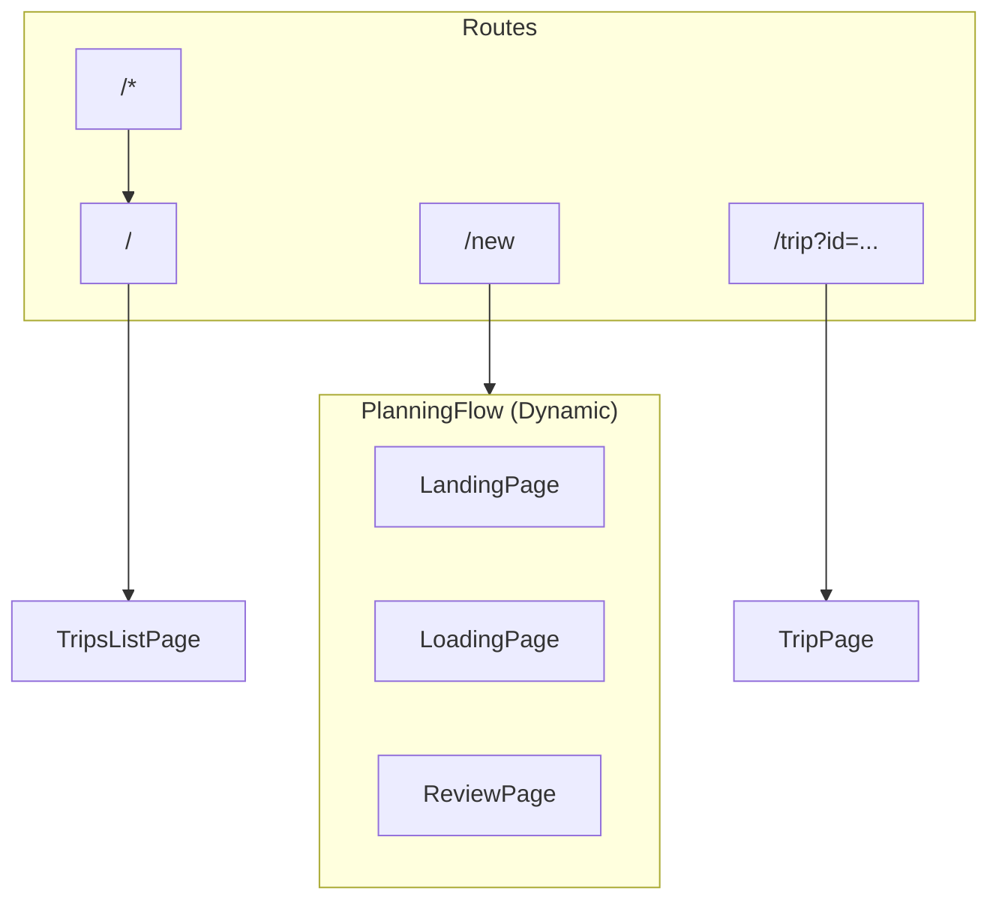
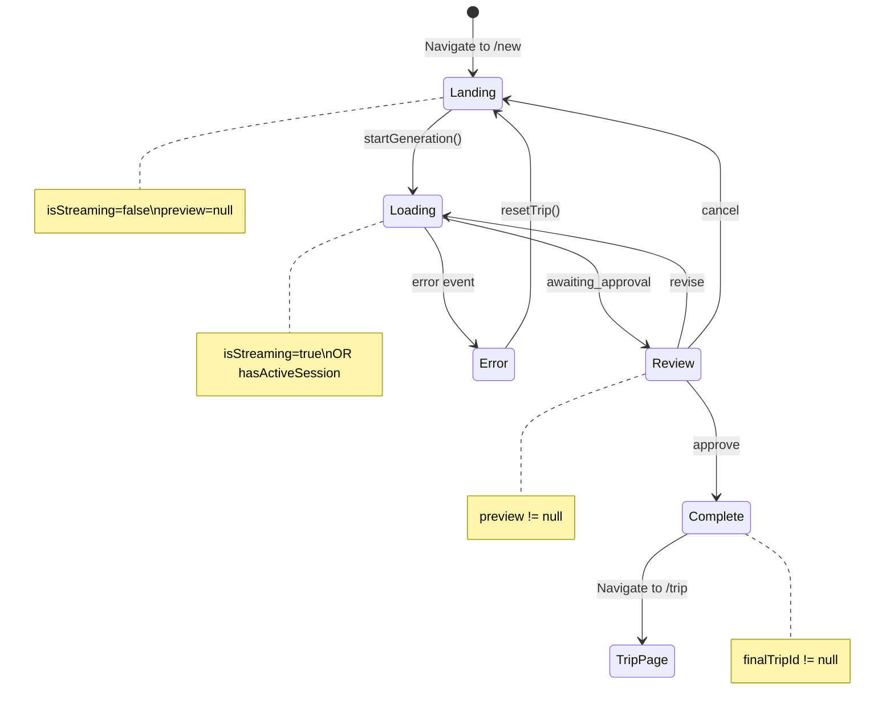
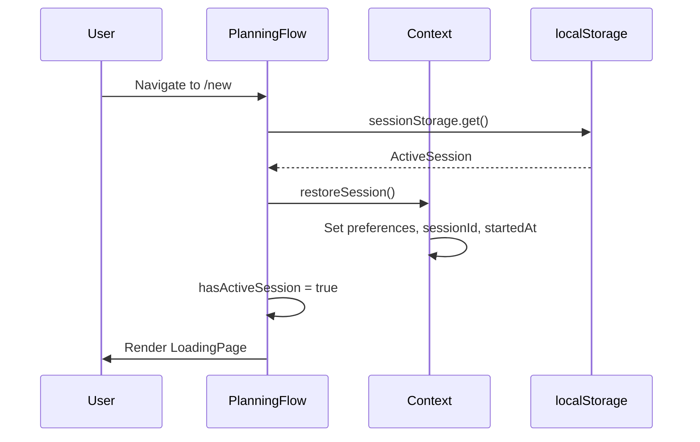

# Routing

Routes, navigation, and PlanningFlow logic.

## Overview

Coastline uses **React Router v7** for client-side routing with a minimal route structure.



## Route Definitions

```tsx
// App.tsx
<BrowserRouter>
  <Routes>
    {/* Home / My Trips */}
    <Route path="/" element={<TripsListPage />} />
    
    {/* New Trip Planning Flow */}
    <Route path="/new" element={<PlanningFlow />} />
    
    {/* View Saved Trip */}
    <Route path="/trip" element={<TripPage />} />
    
    {/* Fallback */}
    <Route path="*" element={<Navigate to="/" replace />} />
  </Routes>
</BrowserRouter>
```

## Route Details

### `/` — TripsListPage

The home screen showing all saved trips.

**Features:**
- List of saved trip cards
- "In Progress" banner if generation ongoing
- "New Trip" button
- Delete trip functionality

**No state dependencies** — fetches trips from API on mount.

### `/new` — PlanningFlow

Dynamic component that renders different pages based on TripContext state.

**State-based rendering:**

| Condition | Renders |
|-----------|---------|
| `finalTripId` set | Redirect to `/trip` |
| `streamError` set | Error UI |
| `preview` set | ReviewPage |
| `isStreaming` OR `hasActiveSession` | LoadingPage |
| default | LandingPage |

### `/trip?id=...` — TripPage

View a saved trip with discovery features.

**Query parameter:** `id` (trip ID)

**Features:**
- Full itinerary view
- Interactive map
- Discovery drawer
- Delete trip

## PlanningFlow Component

The central routing logic for the trip creation flow.

```tsx
function PlanningFlow() {
  const navigate = useNavigate();
  const { 
    isStreaming, 
    preview, 
    finalTripId, 
    streamError, 
    resetTrip, 
    sessionId, 
    hasActiveSession, 
    restoreSession 
  } = useTrip();
  
  const hasCheckedSession = useRef(false);

  // 1. Check for existing session on mount
  useEffect(() => {
    if (!hasCheckedSession.current && !isStreaming && !preview && !finalTripId) {
      hasCheckedSession.current = true;
      restoreSession();
    }
  }, []);

  // 2. Navigate to trip page when complete
  useEffect(() => {
    if (finalTripId) {
      navigate(`/trip?id=${finalTripId}`, { replace: true });
      setTimeout(() => resetTrip(), 200);
    }
  }, [finalTripId]);

  // 3. Clear stale previews
  useEffect(() => {
    if (preview && !sessionId && !isStreaming) {
      resetTrip();
    }
  }, [preview, sessionId, isStreaming]);

  // Render logic
  if (finalTripId) return <Redirecting />;
  if (streamError) return <ErrorUI />;
  if (preview) return <ReviewPage />;
  if (isStreaming || hasActiveSession) return <LoadingPage />;
  return <LandingPage />;
}
```

## State Machine



## Navigation Actions

### Start New Trip

```tsx
// LandingPage.tsx
const { setPreferences } = useTrip();
const { startGeneration } = useTripStream();

const handleSubmit = () => {
  setPreferences(prefs);
  startGeneration(prefs);
  // PlanningFlow auto-renders LoadingPage when isStreaming=true
};
```

### Approve Trip

```tsx
// ReviewPage.tsx
const { submitDecision } = useTripStream();

const handleApprove = () => {
  submitDecision('approve');
  // On complete event, finalTripId is set
  // PlanningFlow navigates to /trip?id=...
};
```

### Cancel Trip

```tsx
// ReviewPage.tsx or LoadingPage.tsx
const { resetTrip } = useTrip();
const navigate = useNavigate();

const handleCancel = () => {
  // Cleanup backend session
  await fetch(`/api/trip/session/${sessionId}`, { method: 'DELETE' });
  resetTrip();
  navigate('/');
};
```

### View Saved Trip

```tsx
// TripsListPage.tsx
const navigate = useNavigate();

<div onClick={() => navigate(`/trip?id=${trip.trip_id}`)}>
  {trip.trip_title}
</div>
```

### Back Navigation

```tsx
// Any page
<button onClick={() => navigate('/')}>
  ← Back to My Trips
</button>
```

## Query Parameters

### `/trip?id=...`

```tsx
// TripPage.tsx
const [searchParams] = useSearchParams();
const tripId = searchParams.get('id');

useEffect(() => {
  if (tripId) {
    loadTrip(tripId);
  }
}, [tripId]);
```

## Session Restoration

When user navigates to `/new` with an existing session:



## Navigation Guards

### Prevent Duplicate Generation

```tsx
// useTripStream.ts
const startGeneration = async (prefs) => {
  if (isStreaming) {
    console.log('Already streaming, ignoring duplicate request');
    return;
  }
  // ...
};
```

### Stale Preview Cleanup

```tsx
// PlanningFlow
useEffect(() => {
  if (preview && !sessionId && !isStreaming) {
    // Preview without session = stale
    resetTrip();
  }
}, [preview, sessionId, isStreaming]);
```

## URL Structure

| URL | Purpose |
|-----|---------|
| `/` | Trips list (home) |
| `/new` | Create new trip |
| `/trip?id=abc123` | View saved trip |

No nested routes or dynamic segments beyond query params.

## Related

- [STATE_MANAGEMENT.md](./STATE_MANAGEMENT.md) - State that drives routing
- [SESSION_PERSISTENCE.md](./SESSION_PERSISTENCE.md) - Session restoration
- [PAGES.md](./PAGES.md) - Page component details

