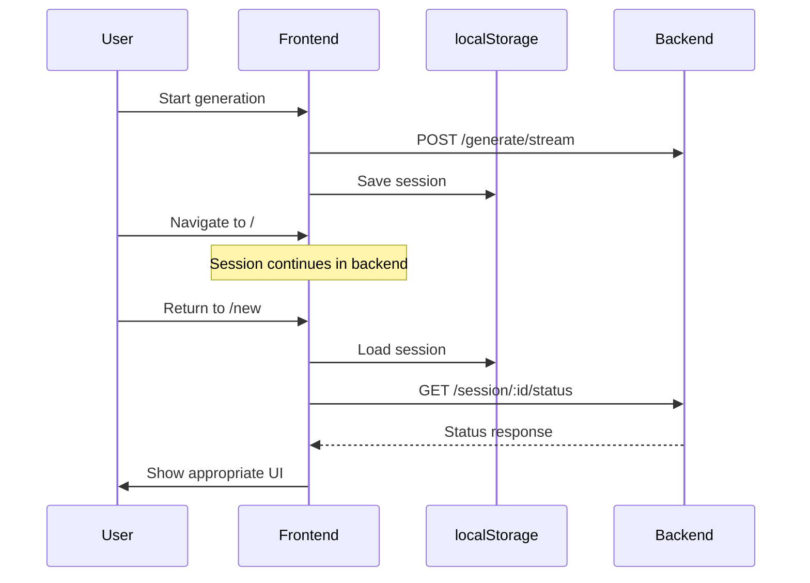
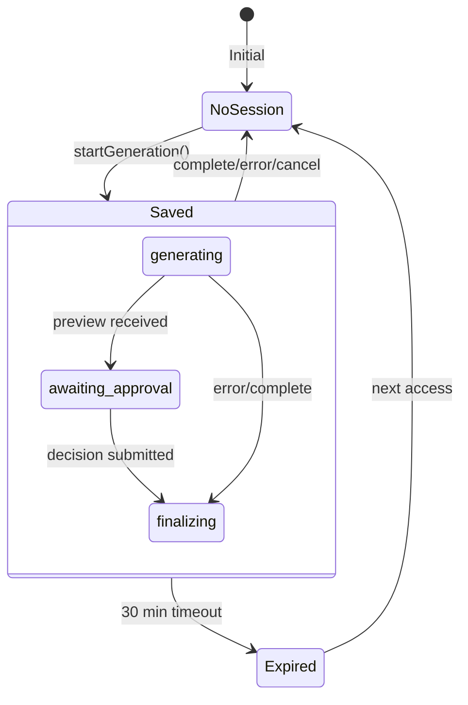

# Session Persistence

Background generation, localStorage, and reconnection.

## Overview

Coastline allows users to navigate away during trip generation. The session state is persisted to **localStorage** and restored when they return.



## sessionStorage Utility

### Location

```
src/utils/sessionStorage.ts
```

### ActiveSession Interface

```typescript
export interface ActiveSession {
  sessionId: string;           // Backend session ID
  preferences: TripPreferences; // User's trip preferences
  startedAt: number;           // Unix timestamp
  status: 'generating' | 'awaiting_approval' | 'finalizing';
  tripTitle?: string;          // For display purposes
}
```

### API

```typescript
export const sessionStorage = {
  save: (session: ActiveSession): void,
  get: (): ActiveSession | null,
  update: (partial: Partial<ActiveSession>): void,
  clear: (): void,
  getElapsedTime: (startedAt: number): string,
};
```

## Storage Key

```typescript
const STORAGE_KEY = 'coastline_active_session';
```

## Operations

### Save Session

```typescript
save: (session: ActiveSession): void => {
  try {
    localStorage.setItem(STORAGE_KEY, JSON.stringify(session));
  } catch (e) {
    console.error('Failed to save session:', e);
  }
}
```

Called when:
- Trip generation starts
- Session ID is received
- Status changes (generating → awaiting_approval)

### Get Session

```typescript
get: (): ActiveSession | null => {
  try {
    const data = localStorage.getItem(STORAGE_KEY);
    if (!data) return null;
    
    const session = JSON.parse(data) as ActiveSession;
    
    // Check if session is too old (> 30 minutes)
    const MAX_AGE_MS = 30 * 60 * 1000;
    if (Date.now() - session.startedAt > MAX_AGE_MS) {
      sessionStorage.clear();
      return null;
    }
    
    return session;
  } catch (e) {
    console.error('Failed to read session:', e);
    return null;
  }
}
```

### Update Session

```typescript
update: (partial: Partial<ActiveSession>): void => {
  const current = sessionStorage.get();
  if (current) {
    sessionStorage.save({ ...current, ...partial });
  }
}
```

### Clear Session

```typescript
clear: (): void => {
  try {
    localStorage.removeItem(STORAGE_KEY);
  } catch (e) {
    console.error('Failed to clear session:', e);
  }
}
```

Called when:
- Trip generation completes
- Error occurs
- User cancels
- Session expires

### Get Elapsed Time

```typescript
getElapsedTime: (startedAt: number): string => {
  const seconds = Math.floor((Date.now() - startedAt) / 1000);
  if (seconds < 60) return `${seconds}s`;
  const minutes = Math.floor(seconds / 60);
  const remainingSeconds = seconds % 60;
  return `${minutes}m ${remainingSeconds}s`;
}
```

## Session Lifecycle



## Integration with TripContext

### Auto-Save on State Change

```typescript
// TripContext.tsx
useEffect(() => {
  if (preferences && startedAt) {
    const session: ActiveSession = {
      sessionId: sessionId || '',
      preferences,
      startedAt,
      status: preview ? 'awaiting_approval' : (isStreaming ? 'generating' : 'finalizing'),
      tripTitle: `${preferences.destinations.join(' → ')} Trip`
    };
    setActiveSession(session);
    sessionStorage.save(session);
  }
}, [sessionId, preferences, startedAt, isStreaming, preview]);
```

### Auto-Clear on Completion

```typescript
useEffect(() => {
  if (finalTripId || streamError) {
    sessionStorage.clear();
    setActiveSession(null);
  }
}, [finalTripId, streamError]);
```

### Load on Mount

```typescript
useEffect(() => {
  const saved = sessionStorage.get();
  if (saved) {
    setActiveSession(saved);
  }
}, []);
```

## Reconnection Flow

When user returns to `/new`:

```typescript
// PlanningFlow
useEffect(() => {
  if (!hasCheckedSession.current && !isStreaming && !preview && !finalTripId) {
    hasCheckedSession.current = true;
    const saved = restoreSession();
    if (saved) {
      console.log('Restored session:', saved);
    }
  }
}, []);
```

```typescript
// TripContext
const restoreSession = (): ActiveSession | null => {
  const saved = sessionStorage.get();
  if (saved) {
    setPreferences(saved.preferences);
    setSessionId(saved.sessionId || null);
    setStartedAt(saved.startedAt);
    setActiveSession(saved);
    return saved;
  }
  return null;
};
```

Then `useTripStream.reconnectSession()` checks backend status:

```typescript
// LoadingPage.tsx
useEffect(() => {
  if (activeSession && !isStreaming) {
    reconnectSession(
      activeSession.sessionId,
      activeSession.preferences,
      activeSession.startedAt
    );
  }
}, [activeSession, isStreaming]);
```

## In-Progress Banner

On TripsListPage, show a banner for active sessions:

```tsx
// TripsListPage.tsx
const { activeSession, hasActiveSession, resetTrip } = useTrip();
const [elapsedTime, setElapsedTime] = useState('');

// Update elapsed time
useEffect(() => {
  if (!activeSession?.startedAt) return;
  
  const update = () => {
    setElapsedTime(sessionStorage.getElapsedTime(activeSession.startedAt));
  };
  
  update();
  const interval = setInterval(update, 1000);
  return () => clearInterval(interval);
}, [activeSession?.startedAt]);

// Render banner
{hasActiveSession && activeSession && (
  <div className={styles.inProgressCard} onClick={() => navigate('/new')}>
    <Loader className={styles.spinningLoader} />
    <span>{activeSession.tripTitle}</span>
    <span>{elapsedTime} elapsed</span>
  </div>
)}
```

## Cancel In-Progress Trip

```tsx
const handleCancelGeneration = (e: React.MouseEvent) => {
  e.stopPropagation();
  sessionStorage.clear();
  resetTrip();
};
```

## Session Expiration

Sessions expire after **30 minutes**:

```typescript
const MAX_AGE_MS = 30 * 60 * 1000; // 30 minutes

if (Date.now() - session.startedAt > MAX_AGE_MS) {
  sessionStorage.clear();
  return null;
}
```

This matches the backend's session TTL (though backend uses 24 hours for the checkpointer).

## Error States

### Session Not Found

If backend returns 404:

```typescript
if (!statusRes.ok) {
  setStreamError('Session expired. Please start a new trip.');
  sessionStorage.clear();
  return;
}
```

### Backend Failed

If status is 'failed':

```typescript
if (status.status === 'failed') {
  setStreamError(status.error || 'Generation failed');
  sessionStorage.clear();
  return;
}
```

## Data Stored

Example localStorage content:

```json
{
  "sessionId": "550e8400-e29b-41d4-a716-446655440000",
  "preferences": {
    "destinations": ["London", "Paris"],
    "start_date": "2026-01-10T00:00:00.000Z",
    "end_date": "2026-01-18T00:00:00.000Z",
    "budget_limit": 3000,
    "origin": "New York"
  },
  "startedAt": 1702234567890,
  "status": "generating",
  "tripTitle": "London → Paris Trip"
}
```

## Testing

### Clear Session Manually

```javascript
// Browser console
localStorage.removeItem('coastline_active_session');
```

### Inspect Session

```javascript
// Browser console
JSON.parse(localStorage.getItem('coastline_active_session'));
```

## Related

- [STATE_MANAGEMENT.md](./STATE_MANAGEMENT.md) - TripContext integration
- [SSE_INTEGRATION.md](./SSE_INTEGRATION.md) - reconnectSession flow
- [ROUTING.md](./ROUTING.md) - PlanningFlow restoration

