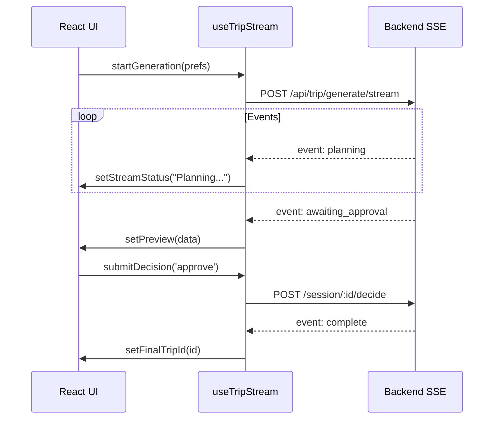
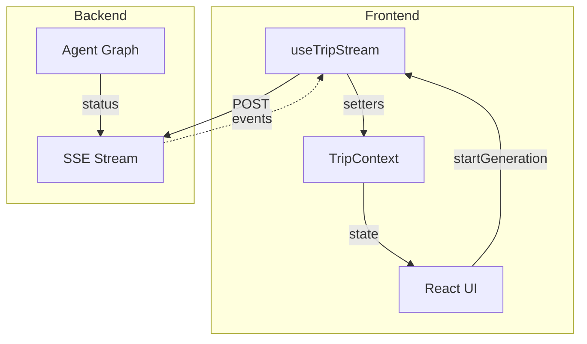

# SSE Integration

Server-Sent Events streaming and the useTripStream hook.

## Overview

Coastline uses **Server-Sent Events (SSE)** for real-time updates during trip generation. The `useTripStream` hook manages the connection lifecycle.



## useTripStream Hook

### Location

```
src/hooks/useTripStream.ts
```

### API

```typescript
const {
  startGeneration,   // Start new trip generation
  submitDecision,    // Submit approve/revise decision
  reconnectSession,  // Reconnect to existing session
  cancelStream       // Abort active connection
} = useTripStream();
```

## SSE Events

Events received from the backend:

| Event | Payload | Action |
|-------|---------|--------|
| `starting` | `{ message }` | Update status |
| `searching` | `{ message }` | Update status |
| `planning` | `{ message }` | Update status |
| `validating` | `{ message }` | Update status |
| `awaiting_approval` | `{ session_id, preview }` | Show review page |
| `complete` | `{ trip_id, itinerary }` | Navigate to trip |
| `error` | `{ message }` | Show error UI |

## Event Handling

```typescript
const handleMessage = useCallback((event: any) => {
  const eventType = event.event || 'message';
  const data = event.data ? JSON.parse(event.data) : {};
  
  switch (eventType) {
    case 'starting':
    case 'searching':
    case 'planning':
    case 'validating':
      setStreamStatus(data.message || 'Processing...');
      sessionStorage.update({ status: 'generating' });
      break;

    case 'awaiting_approval':
      setStreamStatus('Ready for review');
      setSessionId(data.session_id);
      setPreview(data.preview);
      setIsStreaming(false);
      sessionStorage.update({ status: 'awaiting_approval' });
      break;

    case 'complete':
      setStreamStatus('Trip generated!');
      const tripId = data.trip_id || data.itinerary?.trip_id;
      if (tripId) setFinalTripId(tripId);
      setIsStreaming(false);
      sessionStorage.clear();
      break;

    case 'error':
      setStreamError(data.message || 'Unknown error');
      setIsStreaming(false);
      sessionStorage.clear();
      break;
  }
}, [/* deps */]);
```

## Start Generation

```typescript
const startGeneration = async (prefs: TripPreferences) => {
  // Prevent duplicates
  if (isStreaming) return;
  
  // Abort existing connection
  if (abortControllerRef.current) {
    abortControllerRef.current.abort();
  }
  
  const controller = new AbortController();
  abortControllerRef.current = controller;
  
  // Initialize state
  setStartedAt(Date.now());
  setPreferences(prefs);
  setIsStreaming(true);
  setStreamError(null);
  setStreamStatus('Initializing agent...');
  
  // Save to localStorage
  sessionStorage.save({
    sessionId: '',
    preferences: prefs,
    startedAt: Date.now(),
    status: 'generating',
    tripTitle: `${prefs.destinations.join(' → ')} Trip`
  });
  
  try {
    await fetchEventSource('/api/trip/generate/stream', {
      method: 'POST',
      headers: { 'Content-Type': 'application/json' },
      body: JSON.stringify(prefs),
      signal: controller.signal,
      onmessage: handleMessage,
      onerror: (err) => {
        throw new FatalError('Connection failed');
      },
    });
  } catch (err) {
    if (err.name !== 'AbortError') {
      setStreamError('Failed to connect. Please try again.');
      setIsStreaming(false);
      sessionStorage.clear();
    }
  }
};
```

## Submit Decision

```typescript
const submitDecision = async (
  action: 'approve' | 'revise', 
  feedback?: string, 
  newBudget?: number
) => {
  if (!sessionId) return;

  // Abort existing connection
  if (abortControllerRef.current) {
    abortControllerRef.current.abort();
  }

  const controller = new AbortController();
  abortControllerRef.current = controller;

  setIsStreaming(true);
  setStreamStatus(action === 'approve' ? 'Finalizing trip...' : 'Revising itinerary...');
  setPreview(null);
  sessionStorage.update({ status: 'finalizing' });

  try {
    await fetchEventSource(`/api/trip/session/${sessionId}/decide`, {
      method: 'POST',
      headers: { 'Content-Type': 'application/json' },
      body: JSON.stringify({ action, feedback, new_budget: newBudget }),
      signal: controller.signal,
      onmessage: handleMessage,
    });
  } catch (err) {
    // Handle errors
  }
};
```

## Reconnect Session

When user returns to `/new` with an existing session:

```typescript
const reconnectSession = async (
  savedSessionId: string, 
  prefs: TripPreferences, 
  savedStartedAt: number
) => {
  // Restore state
  setSessionId(savedSessionId);
  setPreferences(prefs);
  setStartedAt(savedStartedAt);
  setIsStreaming(true);
  setStreamStatus('Reconnecting...');

  // Check current status
  const statusRes = await fetch(`/api/trip/session/${savedSessionId}/status`);
  
  if (!statusRes.ok) {
    setStreamError('Session expired. Please start a new trip.');
    sessionStorage.clear();
    return;
  }

  const status = await statusRes.json();

  // Handle based on status
  if (status.status === 'complete') {
    setFinalTripId(status.final_itinerary?.trip_id);
    sessionStorage.clear();
    return;
  }

  if (status.status === 'awaiting_approval') {
    setPreview(status.preview);
    setIsStreaming(false);
    return;
  }

  if (status.status === 'failed') {
    setStreamError(status.error || 'Generation failed');
    sessionStorage.clear();
    return;
  }

  // Still processing - poll for updates
  const pollInterval = setInterval(async () => {
    const pollRes = await fetch(`/api/trip/session/${savedSessionId}/status`);
    const pollStatus = await pollRes.json();
    
    if (pollStatus.status === 'complete') {
      clearInterval(pollInterval);
      setFinalTripId(pollStatus.final_itinerary?.trip_id);
      sessionStorage.clear();
    } else if (pollStatus.status === 'awaiting_approval') {
      clearInterval(pollInterval);
      setPreview(pollStatus.preview);
      setIsStreaming(false);
    }
    // etc.
  }, 2000);
};
```

## Cancel Stream

```typescript
const cancelStream = useCallback(() => {
  if (abortControllerRef.current) {
    abortControllerRef.current.abort();
    abortControllerRef.current = null;
  }
  activeSessionIdRef.current = null;
  setIsStreaming(false);
  // Don't clear localStorage - backend continues processing
}, [setIsStreaming]);
```

## Connection Management

### AbortController Pattern

```typescript
const abortControllerRef = useRef<AbortController | null>(null);

// Before new connection
if (abortControllerRef.current) {
  abortControllerRef.current.abort();
}

// Create new controller
const controller = new AbortController();
abortControllerRef.current = controller;

// Use signal
await fetchEventSource(url, {
  signal: controller.signal,
  // ...
});
```

### Session ID Filtering

Ignore events from cancelled sessions:

```typescript
const activeSessionIdRef = useRef<string | null>(null);

const handleMessage = (event) => {
  const eventSessionId = data.session_id;
  
  if (eventSessionId && activeSessionIdRef.current && 
      eventSessionId !== activeSessionIdRef.current) {
    console.log('Ignoring event for cancelled session');
    return;
  }
  // Process event
};
```

## Error Handling

### HTTP Validation Errors (422)

```typescript
if (response.status === 422) {
  const errorData = await response.json();
  const detail = errorData.detail || [];
  
  let errorMessage = 'Validation error: ';
  if (Array.isArray(detail)) {
    errorMessage += detail.map((err: any) => {
      const field = err.loc?.join('.') || 'unknown';
      return `${field}: ${err.msg}`;
    }).join(', ');
  }
  
  setStreamError(errorMessage);
  return;
}
```

### Connection Errors

```typescript
onerror: (err) => {
  console.error('SSE Error:', err);
  throw new FatalError('Connection failed');
},
```

### Abort Errors

```typescript
catch (err: any) {
  if (err.name === 'AbortError') {
    // User cancelled - ignore
    return;
  }
  // Handle other errors
}
```

## Library: @microsoft/fetch-event-source

We use `@microsoft/fetch-event-source` instead of native `EventSource` because:

1. **POST support** — Native EventSource only supports GET
2. **Custom headers** — Can set Content-Type
3. **Better error handling** — `onerror` callback
4. **Retry control** — Can disable auto-retry

```typescript
import { fetchEventSource } from '@microsoft/fetch-event-source';

await fetchEventSource(url, {
  method: 'POST',
  headers: { 'Content-Type': 'application/json' },
  body: JSON.stringify(data),
  signal: controller.signal,
  onmessage: handleMessage,
  onclose: () => console.log('Connection closed'),
  onerror: (err) => { throw new FatalError(); },
  openWhenHidden: true,  // Keep connection when tab hidden
});
```

## Data Flow



## Related

- [Backend SSE Documentation](../../backend/docs/SSE.md)
- [STATE_MANAGEMENT.md](./STATE_MANAGEMENT.md) - Context updates
- [SESSION_PERSISTENCE.md](./SESSION_PERSISTENCE.md) - localStorage sync

