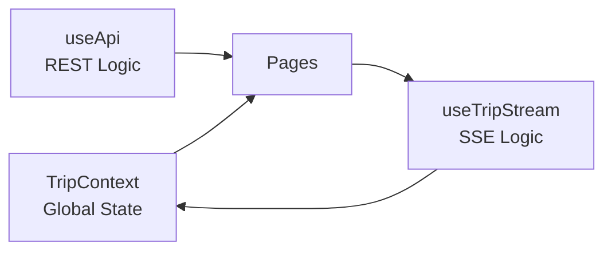
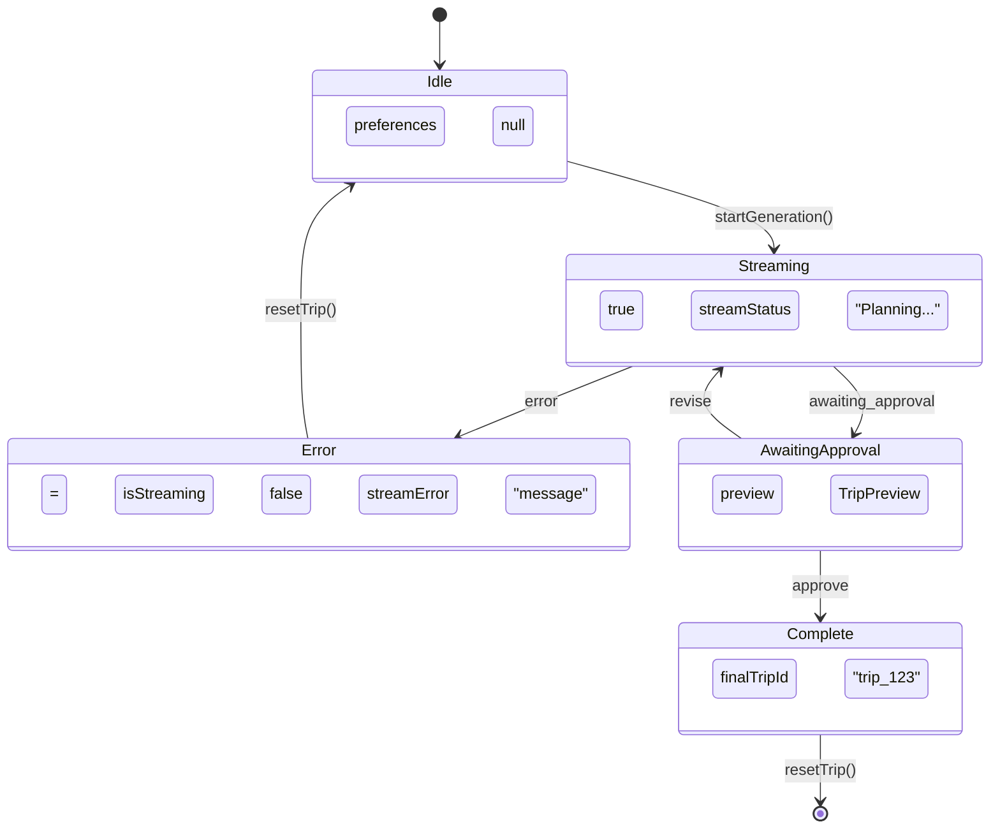

# State Management

TripContext, state patterns, and data flow.

## Overview

Coastline uses **React Context + Hooks** for state management. No external state library (Redux, Zustand) is needed due to the linear flow of the application.



## TripContext

### Location

```
src/context/TripContext.tsx
```

### Provider Setup

```tsx
// main.tsx
import { TripProvider } from './context/TripContext';

createRoot(document.getElementById('root')!).render(
  <TripProvider>
    <App />
  </TripProvider>
);
```

### Full Interface

```typescript
interface TripContextType {
  // === User Input ===
  preferences: TripPreferences | null;
  setPreferences: (prefs: TripPreferences) => void;
  
  // === Session Management ===
  sessionId: string | null;
  setSessionId: (id: string | null) => void;
  
  // === SSE State ===
  isStreaming: boolean;
  setIsStreaming: (streaming: boolean) => void;
  
  streamStatus: string;
  setStreamStatus: (status: string) => void;
  
  streamError: string | null;
  setStreamError: (err: string | null) => void;
  
  // === HITL State ===
  preview: TripPreview | null;
  setPreview: (preview: TripPreview | null) => void;
  
  // === Completion ===
  finalTripId: string | null;
  setFinalTripId: (id: string | null) => void;
  
  // === Session Persistence ===
  startedAt: number | null;
  setStartedAt: (time: number | null) => void;
  
  activeSession: ActiveSession | null;
  hasActiveSession: boolean;
  
  // === Actions ===
  resetTrip: () => void;
  restoreSession: () => ActiveSession | null;
}
```

## State Groups

### 1. User Input State

```typescript
preferences: TripPreferences | null;
```

Holds the user's trip preferences from the form:
- `destinations: string[]`
- `start_date: string`
- `end_date: string`
- `budget_limit: number`
- `origin: string`

### 2. Session State

```typescript
sessionId: string | null;
```

Backend session ID for the current trip generation. Used for:
- Submitting decisions
- Reconnecting to sessions
- Cleanup on cancel

### 3. SSE State

```typescript
isStreaming: boolean;       // Connection active
streamStatus: string;       // "Searching flights..."
streamError: string | null; // Error message if failed
```

### 4. HITL State

```typescript
preview: TripPreview | null;
```

The itinerary preview received at `awaiting_approval` stage:

```typescript
interface TripPreview {
  itinerary: Itinerary;
  total_cost: number;
  cost_breakdown: CostBreakdown;
  budget_limit: number;
  budget_status: 'under' | 'over' | 'unknown';
  revision_count: number;
}
```

### 5. Completion State

```typescript
finalTripId: string | null;
```

Set when trip generation completes. Triggers navigation to `/trip?id=...`.

### 6. Persistence State

```typescript
startedAt: number | null;        // Unix timestamp
activeSession: ActiveSession | null;
hasActiveSession: boolean;       // Derived: activeSession && !complete && !error
```

## Using the Context

### Access State

```tsx
import { useTrip } from '../context/TripContext';

function MyComponent() {
  const { isStreaming, preview, streamStatus } = useTrip();
  
  if (isStreaming) {
    return <p>{streamStatus}</p>;
  }
  
  if (preview) {
    return <ReviewUI preview={preview} />;
  }
  
  return <IdleUI />;
}
```

### Update State

```tsx
function FormComponent() {
  const { setPreferences } = useTrip();
  
  const handleSubmit = (data: TripPreferences) => {
    setPreferences(data);
    // Then call useTripStream.startGeneration()
  };
}
```

## State Transitions



## Derived State

### hasActiveSession

```typescript
const hasActiveSession = activeSession !== null && !finalTripId && !streamError;
```

True when:
- There's a saved session in localStorage
- Trip hasn't completed
- No error occurred

Used to show the "In Progress" banner on TripsListPage.

## Side Effects

### Auto-save to localStorage

```typescript
// TripContext.tsx
useEffect(() => {
  if (preferences && startedAt) {
    const session: ActiveSession = {
      sessionId: sessionId || '',
      preferences,
      startedAt,
      status: preview ? 'awaiting_approval' : (isStreaming ? 'generating' : 'finalizing'),
      tripTitle: `${preferences.destinations.join(' → ')} Trip`
    };
    sessionStorage.save(session);
  }
}, [sessionId, preferences, startedAt, isStreaming, preview]);
```

### Auto-clear on completion/error

```typescript
useEffect(() => {
  if (finalTripId || streamError) {
    sessionStorage.clear();
    setActiveSession(null);
  }
}, [finalTripId, streamError]);
```

### Restore on mount

```typescript
useEffect(() => {
  const saved = sessionStorage.get();
  if (saved) {
    setActiveSession(saved);
  }
}, []);
```

## Reset Function

```typescript
const resetTrip = () => {
  setPreferences(null);
  setSessionId(null);
  setIsStreaming(false);
  setStreamStatus('');
  setStreamError(null);
  setPreview(null);
  setFinalTripId(null);
  setStartedAt(null);
  setActiveSession(null);
  sessionStorage.clear();
};
```

Called when:
- User cancels trip
- Error recovery
- Navigation cleanup

## Restore Function

```typescript
const restoreSession = (): ActiveSession | null => {
  const saved = sessionStorage.get();
  if (saved) {
    setPreferences(saved.preferences);
    setSessionId(saved.sessionId || null);
    setStartedAt(saved.startedAt);
    setActiveSession(saved);
    return saved;
  }
  return null;
};
```

Called by PlanningFlow on mount to restore a session after page reload.

## Best Practices

### 1. Always use hooks for API calls

```tsx
// ❌ Don't update context directly from components
const { setFinalTripId } = useTrip();
fetch('/api/trip').then(data => setFinalTripId(data.id));

// ✅ Use the useTripStream hook
const { startGeneration } = useTripStream();
startGeneration(preferences);
```

### 2. Check state before rendering

```tsx
// ❌ Don't assume preview exists
<div>{preview.itinerary.trip_title}</div>

// ✅ Guard with conditional
{preview && <div>{preview.itinerary.trip_title}</div>}
```

### 3. Don't mutate state

```tsx
// ❌ Don't mutate
preview.itinerary.days.push(newDay);

// ✅ Create new objects
setPreview({
  ...preview,
  itinerary: {
    ...preview.itinerary,
    days: [...preview.itinerary.days, newDay]
  }
});
```

## Related

- [SESSION_PERSISTENCE.md](./SESSION_PERSISTENCE.md) - localStorage details
- [SSE_INTEGRATION.md](./SSE_INTEGRATION.md) - useTripStream hook
- [ROUTING.md](./ROUTING.md) - State-based routing

